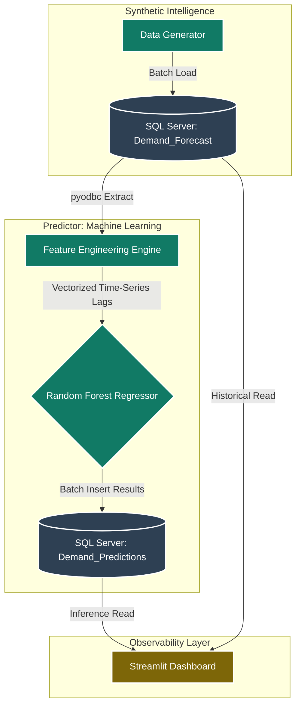

# **Algorithmic-Demand-Forecasting**

> **Enterprise Machine Learning Pipeline for Predictive Demand Planning and Supply Chain Optimization**


## **1. EXECUTIVE SUMMARY & BUSINESS CONTEXT**
In volatile retail and manufacturing environments, accurate demand planning is the cornerstone of operational efficiency. Relying on heuristic-based or manual forecasting methods often leads to inventory stockouts or costly overstock scenarios. "Silent demand drift"—characterized by failing to account for cyclicality, temporal trends, or historical consumption patterns—corrupts supply chain decision-making processes.

This project implements a robust, production-ready End-to-End (E2E) Machine Learning pipeline designed to synthesize historical sales data, generate intelligent forecasts, and visualize operational performance. Acting as a predictive engine for demand planning, the system shifts from reactive inventory management to proactive, data-driven optimization, ensuring highly accurate procurement and distribution strategies.

## **2. STRATEGIC IMPACT & OPERATIONAL ROI**
The implementation of this architecture replaces static, manual forecasting workflows with a dynamic, algorithmic solution, generating immediate and measurable business value:

* **Cyclical Awareness:** The system proactively identifies and quantifies seasonality patterns (e.g., weekend spikes vs. holiday demand), which are often missed by human analysts or simple moving averages.

* **Operational Decoupling:** The architecture separates the heavy computational modeling (Python/Scikit-Learn) from the visual presentation layer (Streamlit) via a SQL-driven persistence layer. This ensures that the analytical dashboard is always performant and decoupled from training overhead.

* **Traceability & Auditing:**Provides clear, historical performance audits, allowing supply chain managers to compare "Actual Sales" vs. "Model Forecast" to identify areas where the model requires re-training or hyperparameter optimization.


## **3. END-TO-END PIPELINE ARCHITECTURE**

The system is designed following a modular, asynchronous architectural pattern where data flows from generation to inference, and finally to observability.


##### 3.1. Architecture Phase Breakdown

1. **Ingestion & Data Synthesis:** A localized data generator simulates real-world business scenarios, incorporating trend, seasonal peaks (weekends/holidays), and controlled noise.

2. **Feature Engineering Engine:** The transformation layer executes time-series logic, converting raw timestamps into predictive features (Lags, Rolling Means).

3. **Model Inference:** The Random Forest engine consumes engineered features to output demand projections, persisting results into the transactional layer.

4. **Presentation Layer:** An interactive Streamlit web application that provides real-time model audit and performance tracking.

## **4. CORE ENGINEERING PRINCIPLES & OPTIMIZATIONS**
##### **4.1. Advanced Time-Series Feature Engineering**
Standard linear regression or simple mean models fail to capture the complex interdependencies of retail data. This pipeline implements a robust feature engineering stack:

* **Temporal Re-engineering:** The system does not treat date/time as a string. It expands date components into granular features (Month, Day_Of_Week, Is_Weekend) to allow the model to learn specific calendrical behaviors.

* **Multi-Period Lags (1, 7, 15 Days):** By implementing `Lag_1 (yesterday), Lag_7 (weekly seasonality), and Lag_15 (bi-weekly trend)`, the model develops "temporal memory," correlating current demand with historically significant intervals.

* **Rolling Window Statistics:**  The 15-day rolling mean acts as a "smoothing operator," allowing the model to distinguish between genuine volume changes and daily stochastic noise.

##### **4.2. Model Selection: Random Forest Regressor**
The Random Forest ensemble is utilized for its resilience against overfitting and its capacity to handle non-linear relationships without requiring extensive data scaling (normalization). By aggregating multiple decision trees, the model effectively minimizes the variance of individual predictions, leading to highly stable forecasts.

##### **4.3. Persistence & Decoupling Strategy**
By using the SQL database as the "Single Source of Truth" and the communication bridge between scripts, we eliminate the need for costly runtime training. The dashboard is "Read-Only," meaning it can serve hundreds of requests simultaneously without consuming memory for model training or data processing.

## **5. DETAILED DATA QUALITY RULES ENGINE**

The pipeline enforces data integrity throughout the lifecycle:

1 **Relational Consistency:** Ensures no orphan predictions exist; every forecasted entry is strictly linked to a valid product and timestamp.

2 **Mathematical Boundary Enforcement:** Automated handling of non-negative constraints for quantity units, ensuring the ML model does not suggest physical impossibilities (e.g., negative inventory sales).

3 **Data Freshness Verification:** The SQL-driven architecture allows for easy verification of "Last Execution Timestamp," ensuring managers never act upon stale model outputs.

## **6. TECHNOLOGY STACK & RATIONALE**
* **Database Engine:** SQL Server (Transact-SQL). Chosen for ACID compliance, robust connectivity via ODBC, and enterprise-grade security.

* **Core Processing Engine:** Python 3.10+. Selected for its comprehensive data science ecosystem.

* **ML Framework:** Scikit-Learn. The industry standard for ensemble-based machine learning implementation, providing efficient tree-based regression.

* **Observability UI:** Streamlit. Enables rapid deployment of an interactive analytical interface, tightly coupled with Python logic.

## **7. SCALABILITY & CLOUD MIGRATION ROADMAP**

While current architecture is localized, the pipeline is structurally prepared for transition:

* **Inference Scale:** The `predictor.py` logic can be containerized within Docker and deployed to serverless environments (e.g., Azure Container Instances) for automated, scheduled inference runs.

* **Data Layer:** The SQL Server instance is fully compatible with managed cloud databases (Azure SQL / Amazon RDS).

* **Orchestration:** The manual execution steps can be integrated into CI/CD pipelines (GitHub Actions) or DAG-based orchestrators (Apache Airflow) for production-grade automation.

## **8. DEPLOYMENT, SETUP, AND REPRODUCTION GUIDE**

##### **Phase 1: Environment Provisioning**

1. Initialize the project directory.

2. Create and activate a Python virtual environment to encapsulate dependencies:
```bash
python -m venv venv
# Activation
.\venv\Scripts\activate  # Windows
source venv/bin/activate # Unix
```
3. Install required libraries:
```bash
pip install pandas numpy scikit-learn pyodbc streamlit matplotlib seaborn
```

##### **Phase 2: Database Configuration**

1. Configure your SQL Server connection details in `config.py.`

2. Ensure the target database exists and tables (`Demand_Forecast, Demand_Predictions`) are created according to the schema.

##### **Phase 3: Pipeline Execution**

1. **Initialize Data:** Generate synthetic demand records.
```bash
python data_generator.py
```
2. **Execute Inference:** Run the model training and prediction pipeline.
```bash
python predictor.py
```
3. **Launch Interface:** Visualize the results.
```bash
streamlit run interface.py
```

## **9. SECURITY AND INFRASTRUCTURE DISCLAIMER**
This codebase is architected for local deployment and portfolio demonstration. In production-grade enterprise settings, all connection strings and credentials must be abstracted via Environment Variables (`.env`) or Secret Management services (HashiCorp Vault, Azure Key Vault). The usage of `Trusted_Connection=yes` assumes local Windows Authentication; cloud deployment requires migration to Service Principal authentication or managed identities for compliance with ISO 27001 standards.

